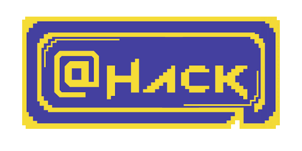
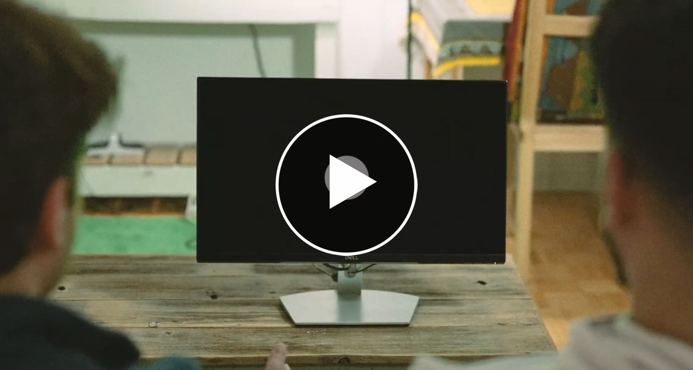

<p align="center"><a href="https://athackctf.com" target="_blank">
</a>
</p>

---
# @HACK 2025 - CTF Challenges
> All challenges form @HACK 2025.

## About @HACK 2025
@HACK 2025 is the 2nd edition of @HACK - a Canadian Capture The Flag (CTF) competition, hosted by [HEXPLOIT ALLIANCE](https://hexploit-alliance.com/) and [TECHNATION](https://technationcanada.ca/) at Concordia University in Montreal.
 - **Location**: Concordia University, Montreal
 - **Dates**: March 1st-2nd, 2025
 - **Prizes**: $16K in cash (💰) + nearly $6K in sponsor prizes (🎁)

## Narrative Film: Jester's Story

> For an immersive experience into the theme of @Hack 2025, watch the short film: _Jester's Story_.

[](https://www.youtube.com/watch?v=LHXLTMRAO74&ab_channel=AtHackCTF)

## Obtain All Challenges

You can fetch all challenges by cloning this repo recursively (including submodules):
```
git clone --recursive https://github.com/athack-ctf/AtHackCTF-2025-Challenges.git
```
Alternatively, you can explore each challenge separately by checking its individual repo (see below).

## All Challenges

| Challenge                                                                                                                                               | Category      | Author                                               | Special Notes                        | Value |
|---------------------------------------------------------------------------------------------------------------------------------------------------------|---------------|------------------------------------------------------|--------------------------------------|-------|
| [AI Leaky ReLU](https://github.com/athack-ctf/chall2025-ai-leaky-relu)                                                                                  | AI            | [Hugo](https://github.com/hkerma)                    |                                      | 300   |
| [Alcohollisions](https://github.com/athack-ctf/chall2025-alcohollisions)                                                                                | Crypto        | [Chit Chit](https://github.com/littleSquid00)        |                                      | 100   |
| [Apocalypse](https://github.com/athack-ctf/chall2025-apocalypse)                                                                                        | Web           | [Chit Chit](https://github.com/littleSquid00)        | `beginner`                           | 50    |
| [Are You Playing Fair](https://github.com/athack-ctf/chall2025-are-you-playing-fair)                                                                    | Crypto        | [Aathira](https://github.com/aathirad)               | `beginner`                           | 50    |
| [Audacious Tunes](https://github.com/athack-ctf/chall2025-audacious-tunes)                                                                              | Stegano       | [Boisghur](https://github.com/boisghur)              | `beginner`                           | 50    |
| [Big Jester is Watching You](https://github.com/athack-ctf/chall2025-big-jester-is-watching-you)                                                        | Hardware      | [Hugo](https://github.com/hkerma)                    | `beginner`                           | 50    |
| [Breach](https://github.com/athack-ctf/chall2025-breach)                                                                                                | Forensics     | Revived by [Houssem](https://github.com/Houssem0x1)  | `author:Cynex-K` `ctf:AlphaCTF-2k23` | 300   |
| [Cardjacker](https://github.com/athack-ctf/chall2025-cardjacker)                                                                                        | Web           | [Anis](https://github.com/AnixPasBesoin)             | `sponsored`                          | 600   |
| [CWE 120](https://github.com/athack-ctf/chall2025-cwe-120)                                                                                               | Pwn           | [Anis](https://github.com/AnixPasBesoin)             | `beginner`                           | 100   |
| [CWE 78](https://github.com/athack-ctf/chall2025-cwe-78)                                                                                                | Pwn           | [Anis](https://github.com/AnixPasBesoin)             | `beginner`                           | 50    |
| [Detached then Forgotten](https://github.com/athack-ctf/chall2025-detached-then-forgotten)                                                              | Pwn           | [Abdussamad](https://github.com/AbSamad99)           | `beginner`                           | 150   |
| [Do NOT mov](https://github.com/athack-ctf/chall2025-do-not-mov)                                                                                        | RE            | [Hugo](https://github.com/hkerma)                    |                                      | 350   |
| [Dora](https://github.com/athack-ctf/chall2025-dora)                                                                                                    | Stegano       | [Chit Chit](https://github.com/littleSquid00)        | `beginner`                           | 50    |
| [Dual Duel](https://github.com/athack-ctf/chall2025-dual-duel)                                                                                          | Crypto        | [Alin](https://github.com/serbancaia)                |                                      | 250   |
| [Flip Fix Frenzy](https://github.com/athack-ctf/chall2025-flip-fix-frenzy)                                                                              | Stegano       | [Aniket](https://github.com/Aaniket09)               | `sponsored`                          | 150   |
| [Forgotten Secret](https://github.com/athack-ctf/chall2025-forgotten-secret)                                                                            | Forensics     | [Hussein](https://github.com/HAOlleik)               |                                      | 300   |
| [Formatting is Weird](https://github.com/athack-ctf/chall2025-formatting-is-weird)                                                                      | Pwn           | [William Mailhot](https://github.com/WilliamMailhot) |                                      | 600   |
| [Hidden In Panoramic Sight](https://github.com/athack-ctf/chall2025-hidden-in-panoramic-sight)                                                          | Miscellaneous | [Alin](https://github.com/serbancaia)                | `beginner` `sponsored`               | 200   |
| [i, humans, I know everything and See Between the liNes](https://github.com/athack-ctf/chall2025-i-humans-i-know-everything-and-read-between-the-lines) | OSINT         | [Jeslyn](https://github.com/JenLys)                  |                                      | 150   |
| If It Works, Don't Patch It                                                                                                                             | Web           | [Abdussamad](https://github.com/AbSamad99)           | `unreleased`                         | N/A   |
| [Insecure by Design](https://github.com/athack-ctf/chall2025-insecure-by-design)                                                                        | Web           | [Anis](https://github.com/AnixPasBesoin)             |                                      | 400   |
| [Jean Guillaume Auguste Victor](https://github.com/athack-ctf/chall2025-jean-guillaume-auguste-victor)                                                  | RE            | [Hugo](https://github.com/hkerma)                    |                                      | 150   |
| Jester's Blog                                                                                                                                           | Web           | [Boisghur](https://github.com/Boisghur)              | `unreleased`                         | N/A   |
| Jester's Testing                                                                                                                                        | Miscellaneous | [Constance](https://github.com/otaphoque)            | `unreleased`                         | N/A   |
| [Little Squid Game](https://github.com/athack-ctf/chall2025-little-squid-game)                                                                          | Pwn           | [Chit Chit](https://github.com/littleSquid00)        |                                      | 100   |
| [Lost Password](https://github.com/athack-ctf/chall2025-lost-password)                                                                                  | Forensics     | [Anis](https://github.com/AnixPasBesoin)             | `beginner`                           | 50    |
| Mainframe                                                                                                                                               | Stegano       | [William Charron-Boyle](https://github.com/jws412)   | `unreleased`                         | N/A   |
| 🚹 🎩 $\frac{\sin{\theta}}{\cos{\theta}}$ [PART 1a] [link](https://github.com/athack-ctf/chall2025-man-hat-sin-cos-1a)                                  | OSINT         | [Jeslyn](https://github.com/JenLys)                  | `beginner`                           | 50    |
| 🚹 🎩 $\frac{\sin{\theta}}{\cos{\theta}}$ [PART 1b] [link](https://github.com/athack-ctf/chall2025-man-hat-sin-cos-1b)                                  | OSINT         | [Jeslyn](https://github.com/JenLys)                  | `beginner`                           | 50    |
| 🚹 🎩 $\frac{\sin{\theta}}{\cos{\theta}}$ [PART 2] [link](https://github.com/athack-ctf/chall2025-man-hat-sin-cos-2)                                    | OSINT         | [Jeslyn](https://github.com/JenLys)                  | `beginner`                           | 100   |
| 🚹 🎩 $\frac{\sin{\theta}}{\cos{\theta}}$ [PART 3] [link](https://github.com/athack-ctf/chall2025-man-hat-sin-cos-3)                                    | OSINT         | [Jeslyn](https://github.com/JenLys)                  |                                      | 100   |
| Merkle Maze                                                                                                                                             | Crypto        | [Aathira](https://github.com/aathirad)               | `unreleased`                         | N/A   |
| [MFT 101](https://github.com/athack-ctf/chall2025-mft-101)                                                                                              | Forensics     | [Houssem](https://github.com/Houssem0x1)             | `beginner`                           | 100   |
| [MFT 201](https://github.com/athack-ctf/chall2025-mft-201)                                                                                              | Forensics     | [Houssem](https://github.com/Houssem0x1)             |                                      | 150   |
| [Misoperate](https://github.com/athack-ctf/chall2025-misoperate)                                                                                        | RE            | [William Charron-Boyle](https://github.com/jws412)   |                                      | 200   |
| (Not So) Smart Contracts                                                                                                                                | Web3          | [Kalyani](https://github.com/highfunctioning)        | `unreleased`                         | N/A   |
| [Noteable Notes](https://github.com/athack-ctf/chall2025-noteable-notes)                                                                                | Stegano       | [Anthony](https://github.com/aa-software2112)        | `beginner`                           | 200   |
| [100% Wrong](https://github.com/athack-ctf/chall2025-one-hundred-percent-wrong)                                                                         | Pwn           | [Anis](https://github.com/AnixPasBesoin)             |                                      | 150   |
| [Phantom Trails](https://github.com/athack-ctf/chall2025-phantom-trails)                                                                                | Forensics     | [Houssem](https://github.com/Houssem0x1)             |                                      | 250   |
| [Relics Of The Past](https://github.com/athack-ctf/chall2025-relics-of-the-past)                                                                        | Forensics     | [Vikas](https://github.com/vikassharma-3)            | `beginner`                           | 200   |
| [RFID 1 - Cleartext](https://github.com/athack-ctf/chall2025-rfid-1-cleartext)                                                                          | Hardware      | [Hugo](https://github.com/hkerma)                    | `sponsored`                          | 400   |
| [RFID 2 - UIDentity Crisis](https://github.com/athack-ctf/chall2025-rfid-2-uidentity-crisis)                                                            | Hardware      | [Hugo](https://github.com/hkerma)                    | `sponsored`                          | 500   |
| [RFID 3 - Pay2Win](https://github.com/athack-ctf/chall2025-rfid-3-pay2win)                                                                              | Hardware      | [Hugo](https://github.com/hkerma)                    | `sponsored`                          | 600   |
| [Rogue Signals](https://github.com/athack-ctf/chall2025-rogue-signals)                                                                                  | Forensics     | [Houssem](https://github.com/Houssem0x1)             | `beginner`                           | 100   |
| [Sanboxer](https://github.com/athack-ctf/chall2025-sandboxer)                                                                                           | RE            | [William Charron-Boyle](https://github.com/jws412)   |                                      | 350   |
| [Shredded Letter](https://github.com/athack-ctf/chall2025-shredded-letter)                                                                              | Miscellaneous | [Anis](https://github.com/AnixPasBesoin)             | `beginner`                           | 350   |
| [Sokobaaaan](https://github.com/athack-ctf/chall2025-sokoban)                                                                                           | Miscellaneous | [Hugo](https://github.com/hkerma)                    | `beginner`                           | 150   |
| [Stack Smashing](https://github.com/athack-ctf/chall2025-stack-smashing)                                                                                | Pwn           | [Anis](https://github.com/AnixPasBesoin)             | `beginner`                           | 200   |
| [Steganoopsies](https://github.com/athack-ctf/chall2025-steganoopsies)                                                                                  | Stegano       | [Hugo](https://github.com/hkerma)                    | `beginner`                           | 50    |
| [Template of Doom - 1](https://github.com/athack-ctf/chall2025-template-of-doom-1)                                                                      | Web           | [Vikas](https://github.com/vikassharma-3)            | `beginner`                           | 100   |
| [Template of Doom - 2](https://github.com/athack-ctf/chall2025-template-of-doom-2)                                                                      | Web           | [Vikas](https://github.com/vikassharma-3)            | `beginner`                           | 100   |
| [The Locked Eternity](https://github.com/athack-ctf/chall2025-the-locked-eternity)                                                                      | Forensics     | [Houssem](https://github.com/Houssem0x1)             |                                      | 350   |
| [TL;DR. Too Long; Didn't Read.](https://github.com/athack-ctf/chall2025-tldr-too-long-didnt-read)                                                       | Web           | [Anis](https://github.com/AnixPasBesoin)             | `sponsored`                          | 450   |
| [Token of Deceit](https://github.com/athack-ctf/chall2025-token-of-deceit)                                                                              | Web           | [Isabella](https://github.com/isabellagudd)          | `beginner`                           | 100   |
| [Upload Deception 101](https://github.com/athack-ctf/chall2025-upload-deception-101)                                                                    | Web           | [Dana](https://github.com/d-abous)                   | `beginner`                           | 50    |
| [Vimprisoned](https://github.com/athack-ctf/chall2025-vimprisoned)                                                                                      | Pwn           | [Anis](https://github.com/AnixPasBesoin)             | `beginner`                           | 150   |
| [Way Too Expensive](https://github.com/athack-ctf/chall2025-way-too-expensive)                                                                          | Web           | [Anis](https://github.com/AnixPasBesoin)             | `sponsored`                          | 400   |
| [XSS One](https://github.com/athack-ctf/chall2025-xss-one)                                                                                              | Web           | [Anis](https://github.com/AnixPasBesoin)             | `beginner`                           | 50    |
| [XSS Two](https://github.com/athack-ctf/chall2025-xss-two)                                                                                              | Web           | [Anis](https://github.com/AnixPasBesoin)             | `beginner`                           | 50    |

## Challenge Design Team

### Leads
 - [Anis](https://github.com/AnixPasBesoin)
 - [Hugo](https://github.com/hkerma)
### Members
- [Aathira](https://github.com/aathirad)
- [Abdussamad](https://github.com/AbSamad99)
- [Alin](https://github.com/serbancaia)
- [Aniket](https://github.com/Aaniket09)
- [Anthony](https://github.com/aa-software2112)
- [Boisghur](https://github.com/boisghur)
- [Chit Chit](https://github.com/littleSquid00)
- [Constance](https://github.com/otaphoque)
- [Dana](https://github.com/d-abous)
- [Houssem](https://github.com/Houssem0x1)
- [Hussein](https://github.com/HAOlleik)
- [Isabella](https://github.com/isabellagudd)
- [Jeslyn](https://github.com/JenLys)
- [Kalyani](https://github.com/highfunctioning)
- [Vikas](https://github.com/vikassharma-3)
- [William Charron-Boyle](https://github.com/jws412)
- [William Mailhot](https://github.com/WilliamMailhot)

## Follow us for more

| [AtHackCTF](https://www.instagram.com/athackctf)                                                                    | [Hexploit Alliance](https://www.instagram.com/hexploitalliance)                                                            | [TECHNATIONca](https://www.instagram.com/technationca)                                                                 |
|---------------------------------------------------------------------------------------------------------------------|----------------------------------------------------------------------------------------------------------------------------|------------------------------------------------------------------------------------------------------------------------|
|  |  |  |
